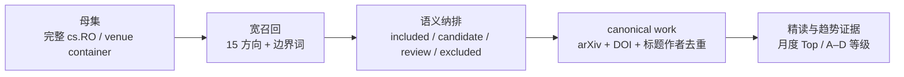

# 语料扩充协议

> 数据截点：2026-08-31。本协议解决的不是“再补几个关键词”，而是让 arXiv、正式发表和开源生态各自拥有完整、可追溯的母集。

## 一、目标与完成定义

语料扩充完成必须同时满足四件事：

1. arXiv 层能够证明每个月的完整页数与唯一 ID 数，而不是只展示检索命中的第一页。
2. 正式发表层允许没有 arXiv ID 的工作存在，并把发现来源、官方录用、正式 proceedings 和期刊发表分开。
3. GitHub 层能够回答“是否真的开放、是否持续维护、是否有独立参与”，而不只展示 stars。
4. 分类层可复现重跑；新增方向不能被固定 schema 阻挡，也不能因改词表而改写历史事实。

## 二、四层漏斗

| 层级 | 是否允许自动化 | 能否直接支持趋势结论 |
|---|---:|---:|
| 母集 | 是 | 否，只提供分母 |
| 自动相关候选 | 是 | 否，只提供筛选队列 |
| canonical work 与官方状态 | 自动合并 + 边界人工复核 | 可支持数量和发表覆盖 |
| 精读证据 | 必须人工核验 | 是 |

## 三、arXiv 采集

### 3.1 母集边界

- 核心：2024-07-01 至 2026-08-31 的 `cs.RO` 月度全量。
- 补充：`cs.AI`、`cs.CV`、`cs.LG` 中包含 robot、robotic、manipulation、locomotion、humanoid、grasping、embodied intelligence、VLA、teleoperation、bimanual 等动作语境的论文。
- 月份：Atom `<published>`，即 v1 日期；修订和正式发表都不能改变首次公开月。

审计时对每月 count-only 请求复算，`cs.RO` 共 24,461 条；每条母集记录都保留 arXiv categories，确保月份与分类可以复算。

### 3.2 分页与缓存

- 日期范围固定使用 14 位秒级边界：`YYYYMMDD000000` 至 `YYYYMMDD235959`。
- 每页 500 条，读取 `opensearch:totalResults` 后遍历全部 offset。
- 每个“月份 × 查询 × offset”保存独立 XML；历史完整页冻结，当前月按 cutoff 建新快照。
- 请求串行、间隔至少 3.1 秒；429/503、EOF、timeout 分开重试。
- 验收要求：每月唯一 ID 数等于 API 总数；页内日期全部落在冻结区间。

### 3.3 为什么不用 Semantic Scholar 作为母集

Semantic Scholar 用于补摘要、引用和外部 ID，不决定语料边界。旧脚本没有消费 bulk search 的后续 token；现存 2026 foundation 缓存就明确少了至少 206 条。OpenAlex 同样只作机构与落地页补源。

## 四、正式发表采集

### 4.1 三种状态不能混用

| 状态 | 严格同行评审分子 | 示例 |
|---|---:|---|
| `peer_reviewed_official_proceedings` | 是 | RSS/CoRL 官方完整卷 |
| `official_publisher_page_verified` | 是 | IEEE、SAGE、Science 单篇出版社页面核验 |
| `official_accepted_pending_proceedings` | 否 | RSS 2026 accepted list |
| `official_program_only` | 否 | ICRA 2026 PaperCept program |
| `publisher_url_from_registered_doi` | 否，待核验 | DBLP/Crossref 发现 DOI 后构造的出版社链接 |
| `discovery_only` | 否 | DBLP、Crossref、OpenAlex、Semantic Scholar |

### 4.2 采集顺序

1. **静态官方容器**：RSS 2024/2025、CoRL 2024/2025，先验证整卷条目数。
2. **机器人会议母集**：ICRA、IROS 用 DBLP/DOI 做完整发现；有 IEEE API key 时回到 Xplore 批量核验。
3. **机器人期刊母集**：RA-L、T-RO、IJRR、Science Robotics 按精确 ISSN 与日期拉取，再回出版社页面核验。
4. **官方 program / pending**：ICRA 2026、RSS 2026 进入候选队列，但不进入严格覆盖率。
5. **跨领域 venue**：ICLR、ICML、NeurIPS、CVPR、ICCV、ECCV 只纳入与机器人动作、执行或交互直接相关的工作。

### 4.3 当前完整容器

| 容器 | 官方条目 | 验收 |
|---|---:|---|
| RSS 2024 | 134 | 与官方索引完全一致 |
| RSS 2025 | 163 | 与官方索引完全一致 |
| CoRL 2024 / PMLR v270 | 264 | 与官方卷完全一致 |
| CoRL 2025 / PMLR v305 | 263 | 与官方卷完全一致 |

这 824 条全部保留；标题初筛没有命中的论文也进入 `manual_review`，不会因旧词表缺失而丢失。

## 五、GitHub 证据

### 5.1 发现入口

- 论文、项目页和 README 中的 GitHub URL。
- GitHub topic/search：robot-learning、vision-language-action、dexterous-manipulation、robotics-dataset、world model、teleoperation。
- Awesome 列表与研究机构 organization 页面只负责发现；最终必须由 GitHub repo API 解析 canonical `owner/repo`。

### 5.2 独立采用代理

IAS-GH（0–100）不使用 stars，分项为：

- 近 12 个月外部 PR 作者；
- 外部 issue 作者；
- 贡献者广度与头部贡献集中度；
- 近 100 个 PR 的合并数；
- forks；
- release 新鲜度。

stars 仍展示为传播元数据。GitHub 通用 API 没有稳定的反向依赖总数，因此缺失保持 `null`，绝不用 forks 冒充 dependents。真正的研究采用还要补第三方代码使用、包依赖、独立复现或 benchmark 渗透。

当月新论文发现的仓库先进入 `data/github-watchlist.json`：只刷新 canonical URL、stars/forks、license 和推送时间，状态固定为 `new_repo_pending_adoption_audit`。只有完成与旧仓相同的 issue/PR 外部作者、贡献者和依赖审计后，才能进入 IAS-GH 排名，避免新仓因 stars 或作者自身活跃被误读为独立采用。

## 六、canonical work 与去重

主键优先级：

1. `arxiv:{id}`；
2. `doi:{normalized-doi}`；
3. `title:{normalized-title + first-author + year hash}`。

合并优先级：

1. 同 arXiv ID；
2. 同 DOI / IEEE article number；
3. 标准化标题完全一致；
4. 标题相似度与作者重合只生成复核对，不自动合并。

特殊规则：

- RA-L 在 ICRA/IROS 展示只记一个 work；会议只写 `presented_at`。
- Early Access 与正式卷页按 DOI 合并，保留两个日期。
- CoRL event year、PMLR publish date 和 BibTeX year分别保存。
- 会议扩展期刊若有实质新方法/实验，可作为 related work 分开，但不能算独立团队验证。

## 七、15 个方向与多轴标签

当前主方向包括：

1. 具身基础模型与通才策略；
2. 分层推理、规划与记忆；
3. 世界模型与预测控制；
4. 灵巧、双臂与接触操作；
5. 人形、运动与全身控制；
6. 导航与移动操作；
7. 人机协作与交互学习；
8. 策略学习与优化；
9. 数据引擎与人类视频学习；
10. 仿真、合成数据与 Sim-to-Real；
11. 动作关联的空间感知与表征；
12. 评测、安全、可靠性与故障恢复；
13. 持续学习、部署学习与自改进；
14. 多机器人协同与群体智能；
15. 触觉、力觉与多模态身体感知。

每篇只有一个主方向，但可以有多个 secondary topics、能力标签、基础设施标签和成熟度标签。新方向正式进入趋势主页前，至少准备 15 条正例、10 条边界例和 10 条反例，并检查跨月连续性与独立团队数。

## 八、数量与质量验收

### 8.1 arXiv

- 月度 `unique_arxiv_ids == totalResults`。
- 99% 以上记录保留原始 categories。
- 随机抽查 100 条未纳入记录，假阴性率低于 5%。

### 8.2 正式发表

- 目标 venue-year/volume 100% 有 manifest 或明确 pending reason。
- 静态官方容器条目数与官方索引完全一致。
- 严格发表标签 100% 有官方页；作者自述 accepted 不计。
- DOI、OpenReview forum、RA-L 转投展示的残余重复为 0。

### 8.3 GitHub

- repo URL 100% 经 API 解析；
- watchers 取 subscribers/watchers，而不是与 stars 同值的 `watchers_count`；
- code/data/model 三种状态分开，`will release` 不计已开放；
- 许可证缺失单独作为风险，不默认视为可用。

### 8.4 趋势

- A/B 级证据门槛不因语料量增加而下降。
- 所有百分比同时显示绝对分子与分母。
- taxonomy 变更前后输出混淆矩阵，不能把分类迁移误判为技术升温。

## 九、月度更新协议

1. 冻结当月 cutoff，补齐 arXiv 页面并验证 manifest。
2. 增量拉 venue、DOI、OpenReview 与 GitHub 快照。
3. 运行 canonical 合并与分类回归。
4. 先更新母集漏斗，再选 10–15 篇精读。
5. 检查弱信号的验证路标与反证，而不是每月重写预测。
6. 发布结构化数据、生成页面、运行链接与构建审计，最后通过 GitHub 部署。
