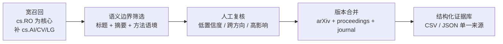

# 检索、分类与趋势判定方法

> **版本**：v1.0 · **数据截点**：2026 年 7 月 29 日（Asia/Shanghai） 
> 本页描述的是可复算流程；任何依赖人工判断的步骤都会明确标注。

## 时间口径

| 层级 | 时间范围 | 用途 | 深度 |
|---|---|---|---|
| 主分析期 | 2025-07-01—2026-06-30 | 逐月趋势、重点论文、实验与开放性指标 | 精读 + 完整分类 |
| 前瞻快照 | 2026-07-01—2026-07-29 | 识别早期信号 | 不与完整月直接比较 |
| 同比基线 | 2024-07-01—2025-06-30 | 数量、主题、机构结构 | 轻量分类 |
| 同行评审窗口 | 2024-07-01—2026-07-29 | 处理提出、投稿、录用与发表之间的滞后 | 官方证据核验 |

月份统一由 [arXiv](https://arxiv.org/) 首次提交版本 `v1` 的日期确定。修订版本更新摘要、DOI 与发表信息，但不重复计数。会议发表月只表示评审完成，并不替代研究首次公开时间。

## 三阶段检索

宽召回优先保证“不漏掉使用新命名的工作”。当前轻量统计语料以 [Semantic Scholar Academic Graph](https://www.semanticscholar.org/product/api) 检索并只保留带官方 arXiv external ID 的记录；90 篇高信号样本再通过 arXiv API 逐条核对 ID、标题、`published`（v1）与摘要。若 arXiv Atom 批量接口可用，仓库也保留以 `cs.RO` 为核心的全量采集脚本。分类关键词只负责生成候选和初步分数；是否纳入高信号论文、是否构成趋势，以及跨方向归类均需结合摘要和方法描述复核。

## 五类主方向

| 代码 | 主方向 | 纳入重点 | 关键边界 |
|---|---|---|---|
| D1 | 具身基础模型 | VLA、generalist policy、多任务预训练、语言条件策略 | 必须输出或学习机器人动作 |
| D2 | 大小脑与双系统 | planner–policy、fast–slow、VLM 与低层控制器协同 | 不要求作者使用“大小脑”名称 |
| D3 | 灵巧操作 | 灵巧手、双臂、触觉、臂手协同、接触密集操作 | 单一简单抓取通常归 D5 |
| D4 | 世界模型 | 动作条件预测、latent action、动力学模型、生成式仿真 | 必须服务动作、规划、控制或机器人数据生成 |
| D5 | 通用机器人学习 | 跨任务/本体、模仿与强化学习、diffusion/flow policy、数据规模化 | 不能仅是特定任务传统控制 |

一篇论文可以拥有多个 `topics`，但只有一个 `primary_topic`。全站的方向数量统计只按主方向计数，防止重复加总；跨方向分析使用多标签。

## 同行评审证据

只接受三类证据：

1. 会议官方 proceedings；
2. [OpenReview](https://openreview.net/) 页面中的最终录用状态；
3. 期刊出版方正式页面。

作者主页、项目页、arXiv comment 中的 “accepted” 或 “to appear” 可作为检索线索，但不能单独升级状态。预印本与正式版本通过 arXiv ID、DOI、标准化标题和作者组合合并。

## 量化指标

所有比例同时显示分子和分母。同比基线仅计算可由元数据稳定推导的指标，不与主分析期的精读标签混用。

| 指标 | 计算方式 | 注意 |
|---|---|---|
| 主题占比 | 某主方向论文数 / 当月纳入论文数 | 多标签不重复计数 |
| 环比 / 同比 | 与上月 / 上年同月绝对数量相比 | 7 月快照不计算环比 |
| 机构集中度 | 头部 5 家机构去重论文数 / 有机构信息论文数 | 多机构合著按每家计一篇 |
| 真实机器人验证率 | 明确报告物理机器人实验的论文数 / 主分析期论文数 | 摘要未披露时不做正向推断 |
| 多任务 / 跨本体 / 长时序 | 满足对应证据标签的论文数 / 主分析期论文数 | 任务变体不自动等于多任务 |
| 开放率 | 明确提供代码、数据或模型任一资产 / 主分析期论文数 | “will release” 不计为已开放 |
| 同行评审覆盖率 | 已有官方录用/正式发表证据的工作数 / 主分析期论文数 | 时间滞后会系统性压低近期月份 |

## 趋势等级

| 等级 | 定义 | 最低证据门槛 |
|---|---|---|
| A 已确认 | 方向已跨团队、跨月扩散，且有正式评审锚点 | 明显跨月或同比增长 + 至少两项独立同行评审工作 |
| B 新兴 | 相邻月份连续出现独立工作，评审证据仍弱 | 至少三项工作 + 至少两个独立机构 |
| C 早期信号 | 高新颖度但样本过少 | 一至两项高信号工作 |
| D 降温/未兑现 | 数量、实验增量或独立跟进不足 | 明确反证或连续缺口 |

分级不是对单篇论文质量打分，而是判断一个研究命题的“趋势证据强度”。

## 可复算性

- `config/taxonomy.json` 固化主题词、排除词、标签和 venue 清单。
- `data/papers.json` 是论文记录的唯一结构化来源。
- `data/trends.json` 记录人工趋势判断及其论文 ID。
- `scripts/generate-site.mjs` 生成月度统计、论文表、机构表和参考索引。
- `scripts/audit-data.mjs` 检查重复 ID、日期范围、趋势证据、官方评审链接与数字一致性。

生成页面不是数据源，不应手工修改其中的数量。修正应先进入结构化文件，再重新生成。

<!-- 更新标记：检索与分类方法 最后更新 2026.07 -->
