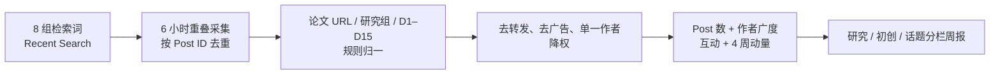

# X 讨论雷达方法

## 数据流

## 为什么不在周一一次性回查

[X Recent Search](https://docs.x.com/x-api/posts/search/introduction) 只覆盖最近 7 天。如果周一凌晨才回查，上周周一早期数据可能已滑出窗口；因此采用 6 小时轮询和 12 小时重叠窗口。

## 检索层

| Query pack | 用途 | D 映射 |
|---|---|---|
| `embodied-core-en` | 具身智能核心讨论（英文） | D1, D2 |
| `embodied-core-zh` | 具身智能核心讨论（中文） | D1, D2, D5 |
| `research-artifacts` | 论文、模型与代码链接 | D1, D3, D4, D5, D8, D9, D10 |
| `startup-frontier` | 领先初创与新产品 | D1, D4, D5, D9, D13 |
| `world-models` | 世界模型与预测控制 | D3 |
| `dexterous-manipulation` | 灵巧、双臂与触觉 | D4, D15 |
| `humanoid-whole-body` | 人形与全身移动操作 | D5, D6 |
| `data-simulation-learning` | 数据、仿真与部署学习 | D8, D9, D10, D13 |

## 热度分数

Post 互动采用加权和：

$$E = likes + 2\,reposts + 2.5\,quotes + 1.5\,replies + 0.25\,bookmarks$$

话题层同时使用四个维度：Post 数、独立作者数、$E$ 和相对近四周基线的动量。互动项有 30% 按作者 followers 的平方根归一，减少大账号对榜单的单点支配；各项再做 $\log(1+x)$ 压缩，并按周内最强话题归一为 0–100。

## 强制边界

- 排除纯转发，保留回复和 Quote，因为它们代表真正讨论。
- 进榜至少需要 2 项 Post 与 2 位作者；单条新论文放入“新兴信号”。
- 公司 Demo、融资和招聘可以成为热门话题，但不会被表述为研究证据。
- 不使用 X 网页 HTML 抓取；采集只通过官方 API。
- 发布前重新 lookup 代表 Post，删除已删除、转私密或暂停账号的内容。参见 [X Batch Compliance](https://docs.x.com/x-api/compliance/batch-compliance/introduction)。

## 成本与限额

X API 使用[按量计费](https://docs.x.com/x-api/getting-started/pricing)，频率限制与账单互相独立。流程会记录每次请求和返回 Post 数，但不在代码中硬编码价格；实际单价以 Developer Console 为准。

## 数据最小化

仓库仅保存 Post ID、author ID、公开互动指标、规范外部 URL、内容指纹和雷达派生标签；不保存 Post 全文。与 X 上删除、转保护或暂停状态不一致的内容，需在 24 小时内从公开页面移除。
